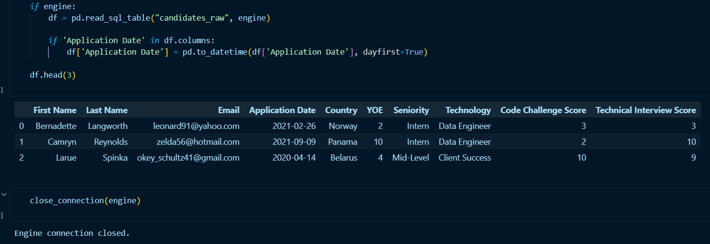
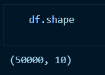
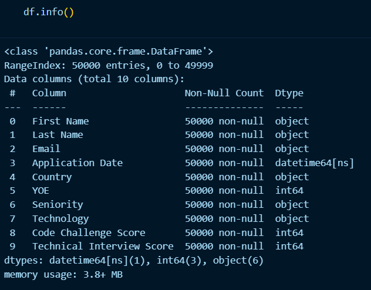
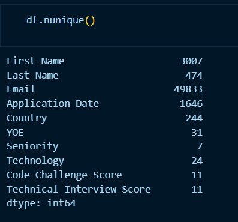
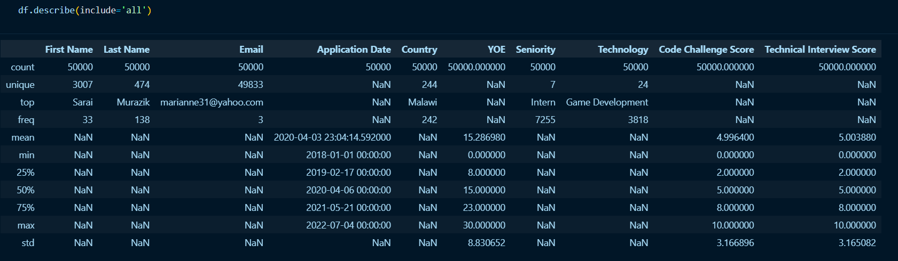
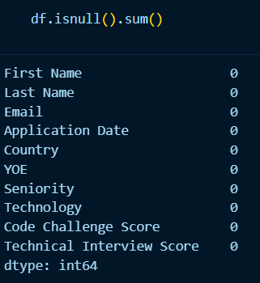

Exploratory Data Analysis
-------------------------

.. contents::
   :local:

Exploratory Data Analysis (EDA) is the process of visually and statistically summarizing, exploring, and understanding the main characteristics, patterns, and relationships within a dataset.

The process conducted in this section involves the application of an Exploratory Data Analysis on the ‘candidates’ data migrated to the PostgreSQL database; this section is linked to the ``001_eda-ipynb`` notebook of the project.

Importing libraries
"""""""""""""""""""

- ``os and sys``: File system manipulation and import paths.
- ``numpy and pandas``: Numerical and tabular data manipulation and analysis.
- ``matplotlib and seaborn``: Data visualization.
- ``sys.path.append``: Add custom paths to import modules.
- ``connection.db_utils``: Custom functions to handle database utilities.

Establishing the database connection
""""""""""""""""""""""""""""""""""""

Database connection is done in the same way as un the extraction process.

Reading the candidates data from the PosgreSQL database
"""""""""""""""""""""""""""""""""""""""""""""""""""""""

This code first checks if an engine (a SQLAlchemy database connection object) is defined. If it exists, the code reads the "candidates_raw" table from the database into a Pandas DataFrame using ``pd.read_sql_table``. Next, it verifies if the column "Application Date" is present in the DataFrame. If so, it converts the values in that column to a datetime format using the ``pd.to_datetime`` function with the ``dayfirst=True`` parameter, which ensures that the day is interpreted before the month (e.g., 31/12/2020 rather than 12/31/2020). This prepares the data for consistent and accurate datetime manipulation.

Following the data retrieval, the ``df.head(3)`` method is invoked. This command displays the first three rows of the DataFrame, providing a concise preview of the data. This allows for immediate verification that the data was successfully extracted from the SQL table and offers a quick look at the structure and initial records of the dataset, facilitating a basic understanding of the data's format and content.

Finally the connection is closed, as a good practice to release resources.

Data profiling
""""""""""""""
Data profiling is an invaluable step in the data preparation process. While it doesn’t fully automate data type mapping, it provides crucial insights needed to make informed decisions and create a well-designed database schema in the future.

Shape of the data
^^^^^^^^^^^^^^^^^

We get the shape of the data using Pandas ``.shape`` method.

The output returned means that this dataset has 50000 rows and 10 columns.

Data types
^^^^^^^^^^

We inspect the columns and their data types using the Pandas ``.info()`` method.

We can see that the DataFrame contains 3 columns with the "int64" data type 6 columns with the "object" data type, and o1 column with the "datetime64" data type. This data types are optimal for our analysis.

Data cardinality
^^^^^^^^^^^^^^^^

The "cardinality" of a column is the number of unique values in it. High cardinality means many unique values, while low cardinality means few.

Pandas ``.nunique()`` method helps us to identify the number of distinct categories in a column, which is essential for analyzing categorical variables.

Implications
************
- **"First Name 3007":** This means there are 3,007 distinct first names in the "First Name" column.
- **"Last Name 474":** There are 474 unique last names. This indicates less diversity compared to first names, potentially suggesting some last names are repeated more frequently.
- **"Email 49833":** This shows 49,833 unique email addresses. Given that the data has 50,000 rows, this suggests that almost every row has a unique email, which is expected, but emails should be unique for each candidate, so this also sugests a duplication problem.
- **"Application Date 1646":** There are 1,646 unique application dates. This indicates that applications were submitted on a variety of different days.
- **"Country 244":** There are 244 distinct countries represented in the dataset. This is suspicious there are 195  recognized countries in the world.
- **"YOE 31":** "YOE" likely stands for "Years of Experience." There are 31 unique values, meaning applicants have a range of experience levels.
- **"Seniority 7":** There are 7 unique seniority levels. This suggests a relatively small number of defined seniority categories.
- **"Technology 24":** There are 24 unique technologies listed. This indicates a variety of technical skills among the applicants.
- **"Code Challenge Score 11":** There are 11 unique scores for the code challenge. This likely means the scores are discrete or binned into a limited number of categories.
- **"Technical Interview Score 11":** Similar to the code challenge score, there are 11 unique technical interview scores.

Describe
^^^^^^^^

We get quick summary of the dataset using the Pandas ``describe()`` method. The ``describe()`` function applies basic statistical computations on the dataset like extreme values, count of data points standard deviation, etc. Any missing value or NaN value is automatically skipped. `describe()` function gives a good picture of the distribution of data.

Note we can also get the description of categorical columns of the dataset if we specify ``include ='all'``  in the describe function.

Implications
************

- The Email column's high uniqueness suggests strong identifiers for individuals, while duplicate First Name or Last Name occurrences are expected since these aren't unique identifiers.

- Technology and Seniority values are skewed toward a few popular categories like "Game Development" and "Intern." Seniority contains 7 unique values, and "Intern" is the most frequent with 7,255 entries. Technology has 24 unique values, and "Game Development" is the most common at 3,818 occurrences.

- The earliest date is January 1, 2018, while the latest is July 4, 2022. This shows the data spans over almost but not quite 4 years, so there is data missing from 2022.

- In both scores (technical interview and code challenge), their means (~5), medians (5), and standard deviations (~3) indicate these scores are symmetrically distributed.

- Country has 244 unique values, with "Malawi" being the most common, appearing 242 times.

Handling missing values
^^^^^^^^^^^^^^^^^^^^^^^

Missing Data can also refer to as NA(Not Available) values in pandas. There are several useful functions for detecting, removing, and replacing null values in Pandas DataFrame. To detect missing values in the DataFrame ``df.isnull().sum()`` is used.

The output confirms that there is no null data in the dataset.

