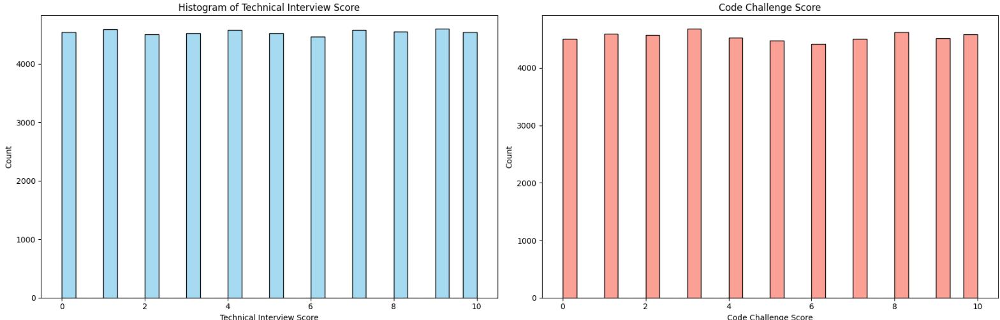
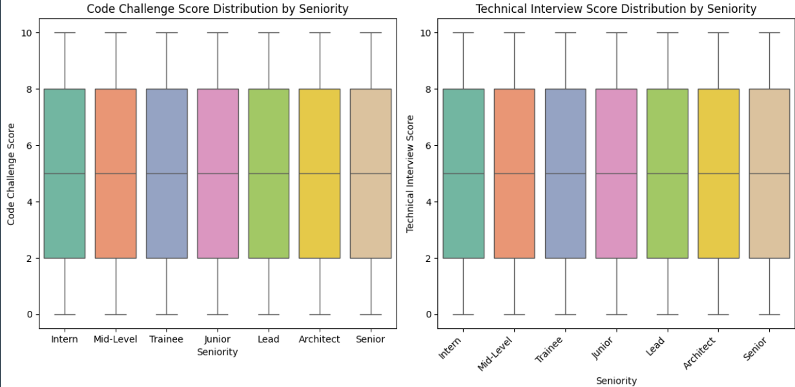

Exploratory Data Analysis: Part 2
---------------------------------

Exploring data characteristics is crucial to gain meaningful insights into its structure, identify potential issues or anomalies, and inform analysis and modeling choices. Documenting findings during this step is essential for future reference or stakeholder communication. This section is linked to the ``001_eda.ipynb`` notebook of the project.

.. contents::
   :local:

Geographical Distribution of Applicants
"""""""""""""""""""""""""""""""""""""""""""""""""""""""""""""""""""""""""""

Top Countries with the Highest Applicant Counts
^^^^^^^^^^^^^^^^^^^^^^^^^^^^^^^^^^^^^^^^^^^^^^^

A bar chart is used to visualize the top 20 countries with the highest applicant counts, created using Seaborn.

    .. image:: ./image/chart1.png
       :width: 600px

**Findings:**

*****************

    - **Even Distribution**: Most countries show nearly the same number of applicants (~250), suggesting equal popularity or deliberate balancing.
    - **Global Representation**: Includes diverse regions from Europe, Asia, Africa, the Americas, and smaller territories, showing inclusivity.
    - **Notable Territories**: The inclusion of regions like Svalbard & Jan Mayen Islands and Netherlands Antilles may reflect outreach to less-common areas.

Top 5 technologies by top 10 countries
^^^^^^^^^^^^^^^^^^^^^^^^^^^^^^^^^^^^^^

A grouped bar chart visualizes the relationship between the top 20 countries and the top 5 technologies. This chart highlights applicant counts for each country-technology combination.

    .. image:: ../images/chart2.png
       :width: 600px

**Findings:**

*********
    
    - Applicant distribution across countries shows significant variation. For example, Malaysia exhibits a peak in interest for Game Development. This could signal a regional specialization or a strong industry presence there.
    
    - Smaller territories like Cook Islands and Saint Helena show consistently lower counts across all technologies, possibly due to their smaller populations. These territories contribute marginally to the total applicant pool, which could indicate limited accessibility or awareness of the technologies.
    
    - Certain countries show a dominant preference for specific technologies. For instance, Malaysia has a clear affinity for Game Development, with a skewed distribution toward this technology. 
    
    
    - Across all countries, Game Development and DevOps emerge as the most popular technologies. This dominance suggests that these fields are globally trending or have more lucrative career opportunities.
    
    - Technologies like Mulesoft and Social Media Community Management have significantly lower counts. These could represent niche interests or fields that are either less familiar or have fewer job opportunities globally.

Technology Distributions
"""""""""""""""""""""""""""""""""
This section analyzes the distributions of Technology with a histogram.

    .. image:: ../images/chart3.png
       :width: 600px

**Findings:**

*********

Game Development and DevOps emerge as the most popular technologies. This dominance suggests that these fields are globally trending or have more lucrative career opportunities, but it also entails stiff competition.
 
Score Distributions
"""""""""""""""""""

This section analyzes the distributions of Code Challenge and Technical Interview Scores. 

Score Distribution Analysis
^^^^^^^^^^^^^^^^^^^^^^^^^^^

Two histograms visualize the distributions for both **Code Challenge Score** and **Technical Interview Score**.

**Findings:**

*********

The histograms reveal striking uniformity in both evaluations, which is uncommon in natural performance data. While this may reflect fairness in the scoring system, it could also obscure valuable insights about candidate performance. Further refinement of the scoring mechanism might help differentiate candidates more effectively

Scores and Seniority Boxplot
^^^^^^^^^^^^^^^^^^^^^^^^^^^^^^^^^^^^^^^^^^^^^^^^^^^^^^^^^

A boxplot is used to analyze the relationship between **seniority levels** and the two scoring metrics (Code Challenge and Technical Interview). It highlights variations and patterns across different experience levels.

**Findings:**

*********

The lack of significant differences in medians indicates that seniority does not appear to influence scores heavily.

