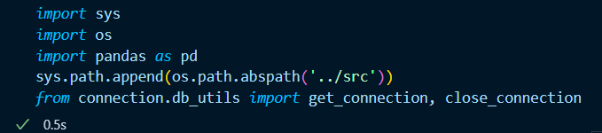
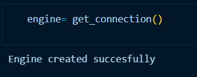
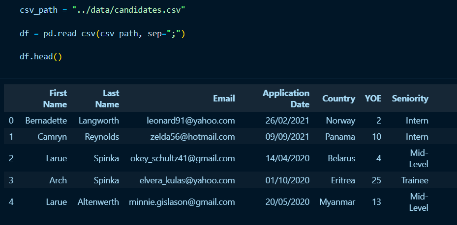
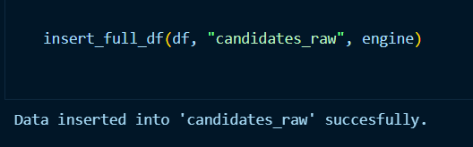
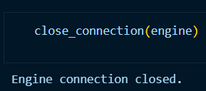

Extraction
--------------

The process conducted in this section involves reading the *candidates.csv* dataset, and transforming it into a Pandas DataFrame for later storage in a database. This documentation is linked to the `001.e.ipynb` notebook of the project.

.. contents::
   :local:

Importing Libraries and Modules
"""""""""""""""""""""""""""""""

- **os and dotenv:** These libraries are used to manage environment variables securely. Loading database credentials from a .env file ensures that sensitive information is not hard-coded into the script, enhancing security and making the codebase more maintainable.

- **sqlalchemy:** This library provides a powerful Object-Relational Mapping (ORM) capability, enabling efficient interaction with the MySQL database. The ``create_engine`` and ``text`` modules from SQLAlchemy simplify the process of connecting to and querying the database. The ``types as sqltypes`` modules provides access to SQLAlchemy's type system, allowing you to explicitly define the data types of columns when creating tables or interacting with data. This is important for data integrity and performance.

- **pandas:** This library is utilized for data manipulation and analysis. Transforming the candidates dataset into a Pandas DataFrame allows for easy manipulation and preparation before writing the data to the MySQL database.

Establishing the Database Connection
""""""""""""""""""""""""""""""""""""

To import and reuse the database connection across different notebooks, the connection logic can be 
encapsulated in Python modules inside a package. This modules will be stored in the ``/src/connection/db_utils.py`` script. 

When `get__connection function` is imported from the module `db_utils.py` into another script or notebook and called, the connection logic will be executed. By following this practice, redundant setup steps can be avoided. 

Creating and Using a "connection" Python Package
^^^^^^^^^^^^^^^^^^^^^^^^^^^^^^^^^^^^^^^^^^^^^^^^

To organize Python code effectively, directories can be designated as packages. By creating the ``connection`` package and using the ``setup_env.py`` and ``db_utils.py modules``, the code  related to database connection and environment setupcan can be organized and streamlined.This involves the following steps:

1. Create the Directory:
************************
       A directory is created to hold related Python modules. This directory becomes the package. The directory needed to be created in this cases is ``connection`` and is created inside the ``./src`` directory.
   

2. Add an ``__init__.py`` File:
*******************************

    An ``__init__.py`` file is placed inside the directory.  This file, even if empty, is *crucial* because its presence signals to Python that the directory should be treated as a package.  It can also contain initialization code for the package, such as setting up default configurations or importing commonly used modules within the package.

3. Add Modules to the Package:
******************************
   Python modules (``.py`` files) containing the actual code are added to the directory.  These modules become accessible through the package.

   The project directory is then organized as follows:
    
    .. code-block::
    
       project/
       ├── data/
       ├── docs/
       ├── notebooks/
       │   └── example_notebook.ipynb
       ├── src/
       │   └── connection/
       │       ├── __init__.py
       │       ├── db_utils.py
       ├── .gitignore
       ├── .readthedocs.yaml
       ├── README.md
       ├── requirements.txt
       └── venv/

``db_utils.py`` module
******************

The `db_utils.py` module contains utility functions for database operations. These functions include connecting to the database and closing the connection to the database.

To establish a connection to the PostgreSQL database, environment variables are loaded from the `/.env file`, which securely stores database credentials. The sqlalchemy library's ``create_engine`` function is used to create a database engine instance, which facilitates the connection to the PostgreSQL database. This approach ensures that the database credentials are not hard-coded into the script, enhancing security. 

    ..  code-block:: python

            from dotenv import load_dotenv
            import os
            from sqlalchemy import create_engine
            
            def get_connection():
                load_dotenv()
                user = os.getenv('PG_USER')
                password = os.getenv('PG_PASSWORD')
                host = os.getenv('PG_HOST')
                port = os.getenv('PG_PORT')
                dbname = os.getenv('PG_DATABASE')
            
                
                db_url = f"postgresql+psycopg2://{user}:{password}@{host}:{port}/{dbname}"
            
                try:
                    engine = create_engine(db_url)
                    print("Engine created succesfully")
                    return engine
                except Exception as e:
                    print(f"Error: {e}")
                    return None
            
            
            def close_connection(engine):
                if engine:
                    try:
                        engine.dispose()
                        print("Engine connection closed.")
                    except Exception as e:
                        print(f"Error closing connection: {e}")
                else:
                    print("No engine to close.")
    

Usage in Notebooks
^^^^^^^^^^^^^^^^^^

To use the ``connection`` package and its modules in the project´s Jupyter notebooks, we have to use `sys.path.append()` which allows importing modules from directories that are not in the default Python search path, a necessary step in this case to reuse a module created in the “source/connection_db” directory of the project dedicated to database utilities:

    ..  code-block:: python

  
         sys.path.append(os.path.abspath('../src'))
         from connection.db_utils import get_connection

   
Then, the modules created are imported.

Now, a SQLite engine object is created using the module `get_connection` located in the project´s `/src/connection/db_utils.py` script. A connection object is created by connecting the engine. 

Reading the dataset and transforming it into a dataframe
""""""""""""""""""""""""""""""""""""""""""""""""""""""""

In this section data is loaded from a CSV file into a DataFrame for further data processing and analysis.
The variable ``csv_path`` stores the relative file path of the *candidates* CSV file in the project. In this case, the file path points to the candidates.csv file located in the data directory, which is one level up from the current working directory (/notebooks).

Then, the ``pd.read_csv`` function reads the CSV file into a DataFrame, with fields separated by semicolons. The DataFrame ``df`` holds the data from the CSV file in a structured format suitable for manipulation and analysis using Pandas.

Data migration to PostgreSQL "ws_001" database
"""""""""""""""""""""""""""""""""""""""""

A ``insert_full_df`` function is defined to insert data from the ``df`` Dataframe into a PostgreSQL database using SQLAlchemy, handling the insertion in two ways: first, it inserts the data in batches to improve performance and stability, and second, it provides a function to insert the entire DataFrame. Both functions use a SQLAlchemy engine configured with environment variables for the database connection, and handle transactions and errors in a robust way.

Its arguments are a  DataFrame (``df``), a table name (`table_name`), an SQLAlchemy engine (``engine``), and a batch size (``batch_size``) as input. It checks if the engine is available, and if so, it attempts to insert the DataFrame into the specified table in batches within a transaction. The DataFrame is divided into smaller chunks based on the batch_size, and each chunk is appended to the database table using ``to_sql``. If any error occurs during the insertion of a batch, the function catches the exception, calculates the batch number where the error occurred, and prints an error message, while the transaction context ensures a rollback. 

It is a general best practice in database programming to always close connections when one is finished with them. Failing to close database connections leads to resource depletion, hinders database performance due to continued resource consumption, risks "connection leaks" that can render the database unresponsive over time, and potentially compromises transaction integrity, making it imperative to implement proper connection closure practices, even with tools like SQLAlchemy that manage many transaction-related tasks.

To accomplish this practice the module ``close_connection`` located in the project´s `/src/connection/db_utils.py` script is used. Its argument is the engine defined earlier.

.. tip::

      Verification of data insertion can be done through the query ``SELECT COUNT(*) FROM candidates_raw``. It should show the 50.000 number, according to the number of columns that running ``df`` showed during the data ingestion process.

         .. image:: ../images/select_count.png
            :align: center
            :width: 600px
