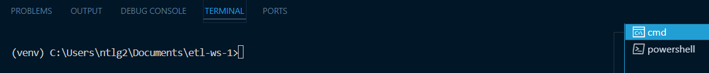
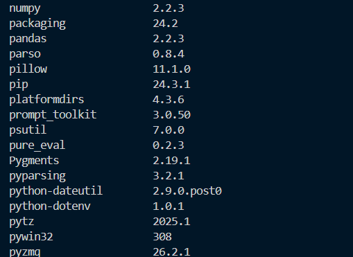
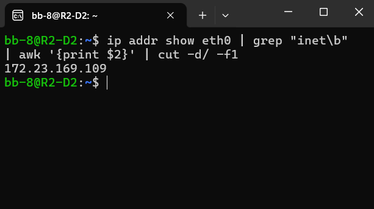

Installation
================

This section explains why certain Python libraries and technologies are used in this project, and provides step-by-step instructions for setting up the project. Python must be installed previusly as well as an integrated development environment (IDE).

.. contents::
   :local:

Prerequisites
-------------

Before you begin, ensure you have met the following requirements:

- **Operating System:** Windows 10 version 2004 and higher (Build 19041 and higher) or Windows 11
- **Python:** 3.12.9
- **IDE**
- Free port (3306).

Installation
------------

Follow these steps to install **etl-ws-1**:

1. Clone the repository:

   .. code-block:: bash

       cd git clone https://github.com/ntlg72/etl-ws-1.git

2. Navigate to the project directory:

   .. code-block:: bash

       cd etl-ws-1

Python Virtual Environment & Dependencies
^^^^^^^^^^^^^^^^^^^^^^^^^^^^^^^^^^^^^^^^^

Virtual environments are essential for modern Python development, providing isolated spaces for each project to manage dependencies and avoid conflicts. By creating a dedicated virtual environment, projects gain their own set of installed packages, separate from the system's Python installation and other projects, preventing version clashes and namespace pollution. This isolation enables reproducible builds and simplifies project setup and deployment.

Implementation
""""""""""""""

1. In the project directory, use the following command to create the virtual environment:

   .. code-block:: bash

       py -m venv <environment_name>

2. The invocation of the activation script is platform-specific (`_<venv>_` must be replaced by the path to the directory containing the virtual environment):

   .. csv-table:: Commands to activate virtual environment
      :header: "Platform", "Shell", "Command to activate virtual environment"
      :widths: 20, 20, 60

      "Windows", "cmd.exe", "C:\\> <venv>\\Scripts\\activate.bat"
      "Windows", "PowerShell", "PS C:\\> <venv>\\Scripts\\Activate.ps1"

3. The project directory contains a `requirements.txt` file listing all necessary dependencies. To install them, while the virtual environment is activated, run:

   .. code-block:: bash

       pip install -r requirements.txt

   You can check the installed dependencies using:

   .. code-block:: bash

       pip list

Installing WSL 2 and Docker for MySQL Deployment
^^^^^^^^^^^^^^^^^^^^^^^^^^^^^^^^^^^^^^^^^^^^^^^^

WSL 2 (Windows Subsystem for Linux 2) provides a lightweight, virtualized Linux environment that integrates seamlessly with Windows, enabling developers to run Linux based tools and applications with improved performance and compatibility. Using a Dockerized MySQL image within WSL 2 allows for consistent, isolated, and portable development environments, which can be easily managed and shared. This approach ensures that the database setup is consistent across different development machines and avoids potential conflicts with other local services or applications. 

.. note::

   - A Dockerized MySQL image is preferred over a local installation because it offers better isolation (preventing dependency conflicts), simplified management (easy start/stop/remove), environment consistency (reducing deployment issues), and streamlined updates/maintenance (easy version control and rollback).
 
   - WSL 2 is used in this case because it provides a Linux kernel running within Windows, enabling Docker Desktop to efficiently run Linux containers (like the MySQL image) using a lightweight virtual machine.

Enabling WSL 2
""""""""""""""

1. Open PowerShell as Administrator.
2. Run:

   .. code-block:: bash

       wsl --install

3. Set WSL 2 as the default version:

   .. code-block:: bash

       wsl --set-default-version 2

Installing Ubuntu
"""""""""""""""""

1. Run the following command in PowerShell:

   .. code-block:: bash

       wsl.exe --install -d Ubuntu-24.04

2. Launch Ubuntu from the Start menu and complete the installation by creating a new user account.

5. **Access MySQL Container:**

   Access the MySQL container's shell:

   .. code-block:: bash

       docker exec -it mysql-db-1 mysql -u <user> -p <user_password>

   Then, enter your password (`your_password`) to access the MySQL shell.

Redash setup
^^^^^^^^^^^^^
Redash is an open-source data collaboration platform that enables you to connect to any data source, visualize data and share it.

Cloning the Repository
""""""""""""""""""""""
We are going to self-host Redash using the official setup script. For this you need to clone the Redash repository in your *WSL 2 Ubuntu 24.04* machine.

.. code-block:: bash

   git clone https://github.com/getredash/setup.git etl-ws-1/redash
   cd etl-ws-1/redash

This will clone the repository into a directory named ``redash`` (already existent inside this project´s directory)and change into that directory.

Docker Compose Configuration
----------------------------

In addition, you need to add a Docker Compose file in your Redash directory to define the services required for running Redash. Navigate to the project repository cloned in your machine, and make sure a ``docker-compose.yml`` files is present with the following content:

.. code-block:: yaml

    x-redash-service: &redash-service
      image: redash/redash:__TAG__
      depends_on:
        - postgres
        - redis
      env_file: /opt/redash/env
      restart: always
    services:
      server:
        <<: *redash-service
        command: server
        ports:
          - "5000:5000"
        environment:
          REDASH_WEB_WORKERS: 4
      scheduler:
        <<: *redash-service
        command: scheduler
        depends_on:
          - server
      scheduled_worker:
        <<: *redash-service
        command: worker
        depends_on:
          - server
        environment:
          QUEUES: "scheduled_queries,schemas"
          WORKERS_COUNT: 1
      adhoc_worker:
        <<: *redash-service
        command: worker
        depends_on:
          - server
        environment:
          QUEUES: "queries"
          WORKERS_COUNT: 2
      redis:
        image: redis:7-alpine
        restart: unless-stopped
      postgres:
        image: pgautoupgrade/pgautoupgrade:latest
        env_file: /opt/redash/env
        volumes:
          - /opt/redash/postgres-data:/var/lib/postgresql/data
        restart: unless-stopped
      nginx:
        image: redash/nginx:latest
        ports:
          - "80:80"
        depends_on:
          - server
        links:
          - server:redash
        restart: always
      worker:
        <<: *redash-service
        command: worker
        environment:
          QUEUES: "periodic,emails,default"
          WORKERS_COUNT: 1

Installation 
"""""""""""""

IWhen running the Redash setup script (``setup.sh``), you might encounter the following error:

.. code-block:: text

   ./setup.sh: 187: pwgen: not found

This error indicates that the ``pwgen`` utility is missing. To fix this, install ``pwgen`` on your system.

Run:

.. code-block:: bash

   sudo apt update && sudo apt install -y pwgen

After installing ``pwgen``, re-run the setup script in the ``pwgen`` directory:

.. code-block:: bash

   ./setup.sh

Mail Configuration
""""""""""""""""""

To enable Redash to send emails (e.g., for alerts or password resets), you must configure
your SMTP settings. Depending on your installation method, these environment variables might
reside in a ``.env`` file (e.g., ``/opt/redash/.env``).

Add the following environment variables, replacing the placeholder values with your actual SMTP
server details:

.. code-block:: bash

   REDASH_MAIL_SERVER=your_smtp_server_address
   REDASH_MAIL_PORT=your_smtp_port
   REDASH_MAIL_USE_TLS=true_or_false
   REDASH_MAIL_USE_SSL=true_or_false
   REDASH_MAIL_USERNAME=your_smtp_username
   REDASH_MAIL_PASSWORD=your_smtp_password
   REDASH_MAIL_DEFAULT_SENDER=your_default_sender_email

**Important:**

- Set ``REDASH_MAIL_USE_TLS`` to ``true`` if your SMTP server requires TLS.
- Set ``REDASH_MAIL_USE_SSL`` to ``true`` if your SMTP server requires SSL.
- Do not set both TLS and SSL to ``true`` simultaneously.

After updating your mail configuration, restart your Redash services to apply the changes (``docker-compose up -d``, running ``docker-compose`` restart won’t be enough as it won’t read changes to env file). To test email configuration, you can run ``docker-compose run --rm server manage send_test_mail``.

Usage
-----

Runnin a MySql Instance with Docker Compose
^^^^^^^^^^^^^^^^^^^^^^^^^^^^^^^^^^^^^^^^^^^^

We will use a single container for our MySQL instance with Docke Compose. In your command line or terminal of your WSL2 machine, navigate to the this project´s directory, and into the ``mysql`` directory. 

.. code-block:: bash

   cd etl-ws-1/redash/mysql

Now you are going to update the existent ``docker-compose.yml``. You must change the default MySQL credentials to suit your needs. Locate the database service section in your Docker Compose file and update the following environment variables with your own credentials:

- **MYSQL_USER**: The username to connect to your database.
- **MYSQL_PASSWORD**: The password for the specified user.
- **MYSQL_ROOT_PASSWORD**: The password for the root user.

Now you can start the container.  Runn ``docker-compose up`` (this might take a while on the first run because Docker needs to pull the containers). You should now have a MySQL instance running.

.. hint::

   If the "3306" port in your host machine is already in use, you aldo need to change the port configurations in the ``docker-compose.yml``.

Setting up a .env file for MySQL Credentials in WSL2 Ubuntu 24.04
^^^^^^^^^^^^^^^^^^^^^^^^^^^^^^^^^^^^^^^^^^^^^^^^^^^^^^^^^^^^^^^^^

A `.env` file is needed to store your MySQL credentials securely, including the WSL2 IP address and the password set up.

1. **Locate the project directory:**

   Navigate to the directory where this repository has been cloned. This is where you'll create the `.env` file. In the terminal, it can be done through the following commands:

   .. code-block:: bash

       cd /path/to/cloned/repository/directory

2. **Create the .env file:**

   In the project directory, create a new file named `.env` (no file extension). You can do this from the command line:

   .. code-block:: bash

       touch .env

   Or using a text editor.

3. **Add your MySQL credentials to the .env file:**

   Open the `.env` file with a text editor and add the following lines, replacing the placeholders with your actual values:

   .. code-block:: text

       MYSQL_USER=your_mysql_username
       MYSQL_PASSWORD=your_mysql_password
       MYSQL_HOST=your_wsl2_ip_address
       MYSQL_DATABASE=ws_001
       MYSQL_PORT=3306

   - **`MYSQL_USER`:** Your MySQL username.
   - **`MYSQL_PASSWORD`:** The password you set for your MySQL user.
   - **`MYSQL_HOST`:** This is _crucial_. You need the IP address of your WSL2 instance. See step 4 below to find this.
   - **`MYSQL_DATABASE`:** The MySQL database created with the Docker command.
   - **`MYSQL_PORT`:** The port MySQL is listening on. The one 3307.

.. hint::

   All this values depends on the ones you defined on the MySQL ``docker-compose.file`` previuosly.

4. **Find your WSL2 IP Address:**

   There are several ways to find the IP address of your WSL2 instance:

   - **From WSL:** Open your WSL2 terminal and run:

     .. code-block:: bash

         ip addr show eth0 | grep "inet\b" | awk '{print $2}' | cut -d/ -f1

   - **From Windows (PowerShell):** Open PowerShell as administrator and run:

     .. code-block:: bash

         wsl hostname -I

   - **From Windows (Command Prompt):** Open command prompt and run:

     .. code-block:: bash

         wsl hostname -I

   The output will be the IP address of your WSL2 instance. Use this IP address for `MYSQL_HOST` in your `.env` file.

5. **Secure the .env file:**

   The `.env` file contains sensitive information. It's _extremely important_ to prevent it from being accidentally committed to version control (like Git). Add `.env` to your `.gitignore` file:

   .. code-block:: text

       .env

Using Redash
^^^^^^^^^^^^^

Login to Redash
"""""""""""""""

Once the setup is complete and the Redash services are running, you can access the
Redash web interface using your browser. By default, the Redash instance will be
available at:

   http://localhost:5000/

Open this URL in your web browser to start using Redash.

How to create a dashboard
"""""""""""""""""""""""""

Dashboard is composed of widgets, which can be any visualization created from the query source page. The dashboard is created by clicking on the “New Dashboard” button on the homepage, assigning it a name and then clicking on the “save” button.

You can also, at any time, create a dashboard by clicking on the dropdown menu on the fixed navbar.

After this, we have only an empty page with the dashboard name. The next steps will explain how to create the widgets to fill the dashboard.

Create query
""""""""""""

Redash comes with an interface to write and run queries on the platform.

Just click on the “New Query” button, type a name to your query (otherwise it will be considered a draft), copy and paste the query inside of the text area and click on the “save” button.

Create visualizations for the query
"""""""""""""""""""""""""""""""""""

All saved queries by default have a ‘Table’ visualization created. You can create more visualizations after the query runs for the first time.

The options are:
    
   -  Chart
    - Cohort
    - Counter
    - Map
    - And more.
    
Click on the “+ New Visualization” button, select Visualization type, set a name and options for the visualization, and then click “save”.

Type the name of the query to see the visualizations available for the query.

Choose the visualization, optionally set the widget’s size (Regular or Double) and click the “Add to Dashboard” button.