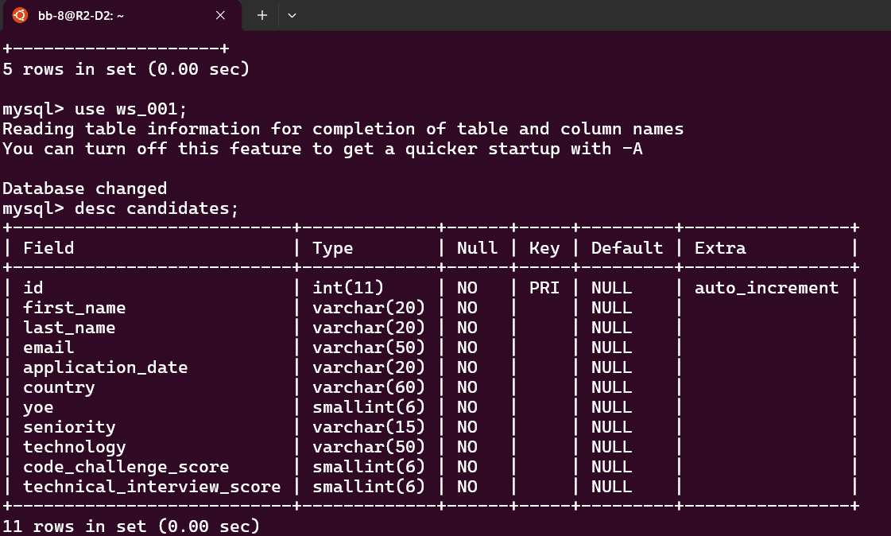
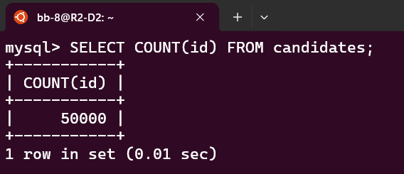

Data Migration
================

.. contents::
   :local:

In order to create a table with adequate and efficient data types for the storage of our database, we must make an inference of the data type from the Dtypes of the Pandas dataframe that is given to us. This is done by the infer_sqlalchemy_type() function, which goes through all the columns of the dataframe and determines the conditions that are met for the assignment of certain types of data.

MySQL Table Design 
------------------

1. Naming Conventions
^^^^^^^^^^^^^^^^^^^^^

Database table names, column names, index names, etc. should follow a naming convention that ensures high readability and uses the English language (in general). When someone looks at the name, they should be able to understand its meaning.

.. caution::

   Table names and column names should be in lowercase letters or numbers. 

2. Choosing Appropriate Field Types
^^^^^^^^^^^^^^^^^^^^^^^^^^^^^^^^^^^

When designing tables, it is important to choose appropriate and efficient field types. 

.. note::

   Data profiling informs and validates the MySQL table design: it determines appropriate data types and lengths based on 
   actual data values.

   For example, if profiling reveals that the longest email is 36 characters, you might set the email column to 
   VARCHAR(50) to provide a margin.

The information obtained during the data profiling process (see :ref:`Profiling data types`) contributes to choosing appropriate data types for the MySQL table design by showing the correspondence between the Pandas data types and suggested MySQL data types. 

    Column 'First Name': Pandas dtype = object, Suggested MySQL type = VARCHAR(11)
    Column 'Last Name': Pandas dtype = object, Suggested MySQL type = VARCHAR(13)
    Column 'Email': Pandas dtype = object, Suggested MySQL type = VARCHAR(36)
    Column 'Application Date': Pandas dtype = object, Suggested MySQL type = VARCHAR(10)
    Column 'Country': Pandas dtype = object, Suggested MySQL type = VARCHAR(51)
    Column 'YOE': Pandas dtype = int64, Suggested MySQL type = <class 'sqlalchemy.sql.sqltypes.SmallInteger'>
    Column 'Seniority': Pandas dtype = object, Suggested MySQL type = VARCHAR(9)
    Column 'Technology': Pandas dtype = object, Suggested MySQL type = VARCHAR(39)
    Column 'Code Challenge Score': Pandas dtype = int64, Suggested MySQL type = <class 'sqlalchemy.sql.sqltypes.SmallInteger'>
    Column 'Technical Interview Score': Pandas dtype = int64, Suggested MySQL type = <class 'sqlalchemy.sql.sqltypes.SmallInteger'>.
    

.. attention::

  "Application Date" should ideally be changeg to MySQL's DATE, DATETIME, or TIMESTAMP type. And shorter VARCHAR lengths    
  and smaller integer types are to be considered if one is sure the range is sufficient.

3. Choosing Appropriate Field Length
^^^^^^^^^^^^^^^^^^^^^^^^^^^^^^^^^^^^

When designing tables, it is necessary to consider field lengths. 

VARCHAR lenghts
"""""""""""""""

The suggested maximum VARCHAR lengths for the columns are based on the maximum observed values during the data profiling process( see :ref:`Profiling the lenght of string values`) , plus some margin for safety. Here are the chosen data types considering the maximum string lengths to improve performance and storage.:

- **First Name:** VARCHAR(20) to handle names up to 11 characters with some extra space.
- **Last Name:** VARCHAR(20) for names up to 13 characters with some additional margin.
- **Email:** VARCHAR(50) to handle emails up to 36 characters plus some buffer.
- **Application Date:** VARCHAR(60)  to dates up to 10 characters with some extra space. It will be transformed in the future.
- **Country:** VARCHAR(60) for country names up to 51 characters.
- **YOE:** TINYINT UNSIGNED, suitable for storing small integer values (0-255).
- **Seniority:** VARCHAR(15) for values up to 9 characters plus margin.
- **Technology:** VARCHAR(50) to handle up to 39 characters plus some buffer.
- **Code Challenge Score:** TINYINT UNSIGNED to store small integer scores (0-255).
- **Technical Interview Score:** TINYINT UNSIGNED to store small integer scores (0-255).

Creation
^^^^^^^^

Using a a Class to create the table
"""""""""""""""""""""""""""""""""""

Using a class to define the table structure leverages Object-Relational Mapping (ORM). ORMs map class definitions in code to relational database tables, providing several benefits:

- **Abstraction and Convenience:** By using classes, you interact with the database through objects and methods instead of writing SQL queries directly. This abstracts the database interaction, making code easier to write, read, and maintain.

- **Type Safety:** ORM enforces type safety. This means you define the data types once in your class, and the ORM ensures that the database and your code adhere to these types, reducing the risk of runtime errors.
    
- **Maintainability:** Changes to the database schema are easier to manage. If you need to add, modify, or remove a column, you update the class definition, and the ORM handles the database changes.
    
- **Reusability:** The class can be reused in different parts of the application.
    
- **Consistency:** Using classes ensures consistent handling of database operations across the application. The table structure is defined once, and the ORM uses this definition for all interactions.

Implementation
""""""""""""""

.. image:: ../images/table-create.png
   :align: center
   :width: 600px 

