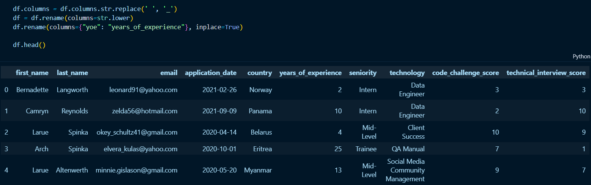
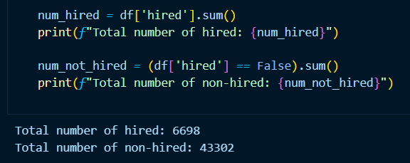
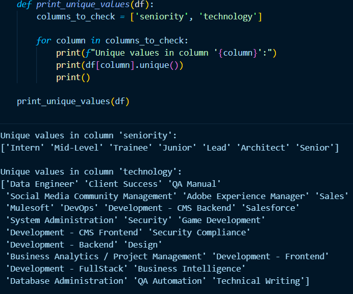
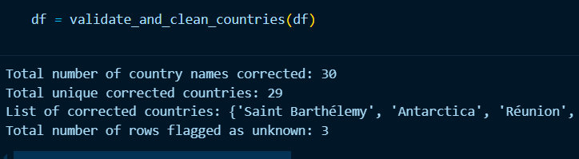
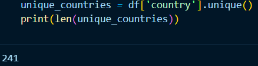
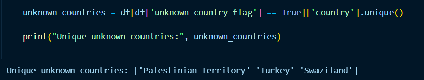
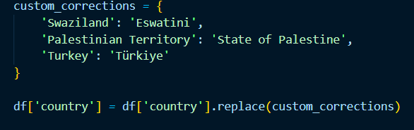
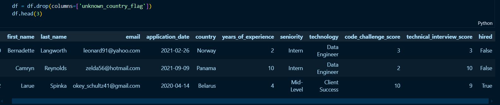
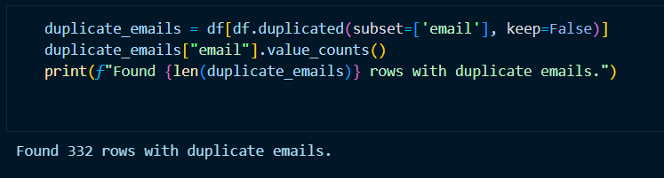
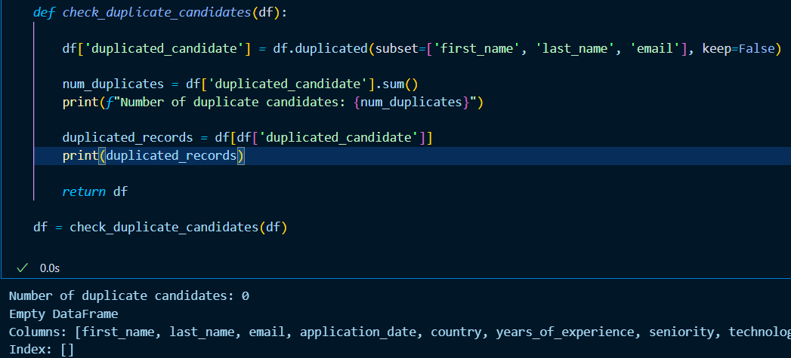

Transformation & Load
---------------------

The process conducted in this section involves the application of a series of transformations on the‘candidates’ data migrated to the PostgreSQL database.Here, the data is transformed and consolidated for its intended analytical use case. Then the transformed data is moved into a target data database. This section is linked to the ``001_tl.ipynb`` notebook of the project.

.. contents::
   :local:

Importing libraries
"""""""""""""""""""

- ``os and sys``: File system manipulation and import paths.
- ``numpy and pandas``: Numerical and tabular data manipulation and analysis.
- ``re``: Text processing using regular expressions.
- ``matplotlib and seaborn``: Data visualization.
- ``fuzzywuzzy``: String comparison.
- ``pycountry``: Geographical data handling and international standards.
- ``sys.path.append``: Add custom paths to import modules.
- ``connection.db_utils``: Custom functions to handle database utilities.

Establishing the database connection
""""""""""""""""""""""""""""""""""""

Database connection is done in the same way as in the extraction and EDA process.

Reading the candidates data from the PosgreSQL database
"""""""""""""""""""""""""""""""""""""""""""""""""""""""

This process is done in the same way as in the EDA process.

Transformation 
""""""""""""""
Column names
^^^^^^^^^^^^^

Database table names, column names, index names, etc. should follow a naming convention that ensures high readability and uses the English language (in general). In this case the columns follow the guidelines, but can be formated to be in lowercase letters, and their spaces replaced by underscores.

The first line of code, focuses on standardizing column names by replacing spaces with underscores. This is achieved by accessing the column names through ``df.columns``, using the ``.str`` accessor to apply string operations element-wise, and then utilizing the ``.replace(' ', '_')`` method to perform the substitution. The modified column names are then reassigned back to ``df.columns``.

Following this, the second line further cleans the column names by converting all characters to lowercase. The ``df.rename()`` method is employed with the `columns=str.lower` argument, which applies the `str.lower` function to each column name. The result is a new DataFrame with all column names in lowercase

.. note::

    Now all columns are in *Snake case* , a way of writing phrases without spaces, where spaces are replaced with     
    underscores, and the words are typically all lower case. 

Obtaining the hired candidates
^^^^^^^^^^^^^^^^^^^^^^^^^^^^^^

A candidate is considered HIRED when she/he has both scores greater than or equal to 7.

To flag the hired candidates, a ``mark_hired_candidates`` is defined. It processes a DataFrame, and creates a new column called hired in the DataFrame. The value in this column is determined by a logical condition: a candidate is marked as ``True`` (hired) if their code_challenge_score is greater than or equal to 7 and their technical_interview_score is also greater than or equal to 7. Otherwise, the value is ``False``. Finally, the modified DataFrame is returned. 

We count the total number of canditates hired and non hired.

Verifying input values in "seniority" and "technology" columns
^^^^^^^^^^^^^^^^^^^^^^^^^^^^^^^^^^^^^^^^^^^^^^^^^^^^^^^^^^^^^^

A simple ``for`` loop to print the unique values in the seniority and technology columns of the dataset. Printing the unique values in dataset columns like "seniority" and "technology" can help verify there are no invalid or incorrect inputs. By inspecting the unique values, one can quickly identify any unexpected entries (e.g., typos, inconsistent formatting, or irrelevant values) that might cause issues in data processing or analysis.

In this case there are not evident inlavid inputs:

- **Seniority:** All the values seem valid and consistent, representing typical seniority levels (e.g., Intern, Mid-Level, Lead, etc.). There are no obvious invalid inputs here.
- **Technology:** The entries also look reasonable, covering a wide range of roles and areas (e.g., Data Engineer, DevOps, Salesforce, etc.). There don’t appear to be typos or strange inputs.

Country validation
^^^^^^^^^^^^^^^^^^

A ``validate_and_clean_countries(df)`` function is defined to validate and clean a column of country names in the DataFrame (df). The function ensures that country names in the DataFrame are valid and standardized. It uses fuzzy matching (from the ``fuzzywuzzy`` library) to correct misspelled or non-standard country names and flags rows with invalid or unknown country names.

.. note::

    **Steps:**
    
    1. **Generate a Reference List of Countries:** A list of valid country names (reference_countries) is created using the ``pycountry`` library, which contains standardized country names.
    
    2. **Correct Country Names:**
    
        - The function iterates through the country column in the DataFrame and uses fuzzy matching to find the closest valid country name from the reference list.
        - If a match with a high similarity score (≥ 80) is found, the country name is corrected.
        - If no valid match is found, the original value is retained, and the row is flagged as containing an unknown country.

    3. **Track Corrections and Flags:** The function keeps track of:
        
        - The number of corrections made (corrections_count).
        - The unique list of corrected country names (corrected_country_list).
    
    The number of rows flagged as containing unknown or invalid country names (flagged_rows_count).
    
    4. **Add a Flag Column:** A new column (unknown_country_flag) is added to the DataFrame to indicate rows with invalid or unknown country names.
    
    5. **Print Metrics:** The function prints summary metrics, including:
    
        - The total number of corrections.
        - The unique list of corrected countries.
        - The number of rows flagged as containing unknown countries.
    
    6. **Return the Cleaned DataFrame:** The function returns the cleaned DataFrame with corrected country names and the new flag column.
    

This output means that the dataset had 30 instances of country names that were corrected. Out of these corrections, 29 were unique country names, which indicates that one country name was corrected multiple times (likely because it appeared in the dataset more than once and was corrected in each instance).

After validation, there are 241 unique countries, and initially there were 244. Some entries might have been regions, territories, or other geopolitical entities that pycountry recognizes, but one might not consider as independent countries; or the names of the countries were typed in a non standard form.

Inspecting registers flagged with "Unknown" country
***************************************************

The rows (3 in this case) flagged by the ``unknown_country_flag`` do not contain a valid or recognizable country name, and instead has been replaced with the placeholder.This helps identify which rows might need further attention or correction.

To proceed, we extract the unique values of countries flagged as unknown.

.. note::

    **Why this happens:**
    
    - **Swaziland:** The country officially changed its name to Eswatini in 2018. If  ``pycountry`` ´s reference list is up-to-date, older names like "Swaziland" might not match.
    
    - **Palestinian Territory:** This might not exist in ``pycountry`` ´s reference list as it might only contain recognized sovereign states.
    
    - **Turkey:** The country officially requested to use its name Türkiye in international contexts instead of "Turkey."

Handling registers flagged with "Unknown" country
***************************************************

We are going to apply corrections to the country column, reeplacing outdated country names with their current, officially recognized counterparts. This is accomplished thought the Pandas ``.replace()`` method and a dictionary.

Now, the column used for the validation process can be droped.

E-mail duplicates
^^^^^^^^^^^^^^^^^^
As signaled before in the "Data cardinality" section, there is a duplication problem with the e-mails, as these should be unique for each candidate. But before adressing this issue, validating email addresses with Regex (regular expresions) comes first.

.. note::
    The code defines two functions to validate email addresses in a DataFrame using a regular expression (regex). The ``validate_with_regex(email)`` function checks if a single email matches a standard email format, while ``validate_email_column(df)`` applies this validation to an entire column of emails in a DataFrame, adding a new column (``email_valid``) to indicate valid (``True``) or invalid (``False``) emails. After validation, the code filters and prints the invalid emails for further review. This is useful for ensuring data quality by identifying and flagging improperly formatted email addresses in a dataset.

    .. image:: ../images/email1.png
       :align: center
       :width: 600px 

There are not invalid emails in the dataset. But there are 332 rows with duplicated emails.

Are there candidates applying in diferent dates?
************************************************

We have to review if there are candidates applying in different dates, hence the email duplication. This is accomplished through the ``chekc_duplicate_candidates`` function that checks for duplicate candidates based on the combination of first name, last name, and email. It returns a DataFrame with a '`duplicated_candidate`` column and prints the number of duplicates.

The output indicates there are not candidates applying in diferent dates.

.. note::
    **Interpretation of the Output:**

    - **Number of duplicate candidates: 0:** This means that no duplicate rows were found in the DataFrame based on the columns first_name, last_name, and email.
    
    - **Empty DataFrame:** The duplicated_records DataFrame is empty because there are no duplicates to display.
    
    - **Columns and Index:** 
    
        - The list of columns (first_name, last_name, email, etc.) shows the structure of the DataFrame.
        - The Index: [] indicates that no rows were included in the duplicated_records DataFrame because no duplicates were found.
    
Handling duplicates emails
**************************

To solve this problem using Pandas, we can follow these steps:

1. Sort the table based on the “application_date” column in ascending order (in-place sorting).

.. note::

    This code sorts a DataFrame (``df``) by the ``application_date`` column in ascending order (oldest to newest) using ``sort_values``, with the ``inplace=True`` parameter ensuring the changes are applied directly to the DataFrame. After sorting, it checks if the application_date column is monotonically increasing (i.e., each date is equal to or later than the previous one) using the is_monotonic_increasing attribute. The result (``True`` or ``False``) is stored in is_ordered and printed, confirming whether the dates are now in a strictly increasing order. This is useful for verifying the correct chronological sorting of data.

    .. image:: ../images/asc_dates.png
       :align: center
       :width: 600px 

2. Drop duplicate entries, keeping only the first occurrence (in-place drop duplicates), which is flagged as hired.

.. note::

    This code sorts a DataFrame (``df``) by the ``application_date`` column in ascending order (oldest to newest) using ``sort_values``, with the ``inplace=True`` parameter ensuring the changes are applied directly to the DataFrame. After sorting, it checks if the application_date column is monotonically increasing (i.e., each date is equal to or later than the previous one) using the is_monotonic_increasing attribute. The result (``True`` or ``False``) is stored in is_ordered and printed, confirming whether the dates are now in a strictly increasing order. This is useful for verifying the correct chronological sorting of data.

    .. image:: ../images/drop_emails.png
       :align: center
       :width: 600px 

After removing duplicate entries in the dataset, the total number of rows (or "registers") left corresponds exactly to the total number of individuals hired, which is 6,698 ("Total number of hired: 6698" obtained earlier).

    **Implications:**
    
    - The duplicate entries that were removed were related to individuals who were not hired or irrelevant rows in the context of those flagged as hired.
    - All entries for individuals who were hired have been retained after handling duplicates, as the total number of remaining rows matches the total hired count.
    - The resulting dataset is now cleaner, containing only unique records and focusing solely on hired candidates.

Finally, the columns used for validation are dropped.

    .. image:: ../images/drop_flags.png
       :align: center
       :width: 600px 

Load
""""
A SQLite engine object is created again using the module `get_connection` located in the project´s ``/src/connection/db_utils.py`` script. Then, a connection object is created by connecting the engine.

.. image:: ../images/engine_conn.png
   :align: center
   :width: 500px 

A ``insert_full_df`` function is defined to insert data from the ``df`` Dataframe into a PostgreSQL database using SQLAlchemy, handling the insertion in two ways: first, it inserts the data in batches to improve performance and stability, and second, it provides a function to insert the entire DataFrame. Both functions use a SQLAlchemy engine configured with environment variables for the database connection, and handle transactions and errors in a robust way.

Its arguments are a  DataFrame (``df``), a table name (``table_name``), an SQLAlchemy engine (``engine``), and a batch size (``batch_size``) as input. It checks if the engine is available, and if so, it attempts to insert the DataFrame into the specified table in batches within a transaction. The DataFrame is divided into smaller chunks based on the ``batch_size``, and each chunk is appended to the database table using ``to_sql``. If any error occurs during the insertion of a batch, the function catches the exception, calculates the batch number where the error occurred, and prints an error message, while the transaction context ensures a rollback. 

.. image:: ../images/hires_clean.png
   :align: center
   :width: 500px 

All regissters were inserted into the "hires_clean" table. To close the connection to de database the module ``close_connection``, located in the project´s ``/src/connection/db_utils.py`` script, is used. Its argument is the engine defined earlier.

.. image:: ../images/close_conn1.png
   :align: center
   :width: 500px 
